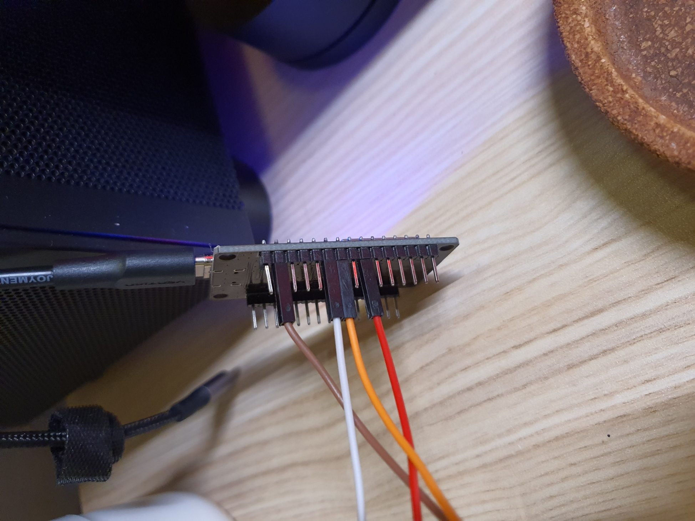
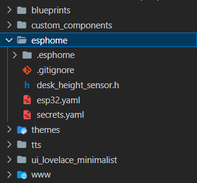

# Flexispot E7 Smart Desk Docs

This repository contains my current HomeAssistant smartdesk setup. Feel free to explore the code, configuration. Kindly note that this is not fully details guide. For more detailed info, kindly checkout these awsome resources:

- [LoctekMotion_IoT](https://github.com/iMicknl/LoctekMotion_IoT/tree/main)
- [Video Guide](https://www.youtube.com/watch?v=ZebpHxfhHfA&t=1s)
- [Success Example Video](https://youtube.com/shorts/9_znj6x3IMw?feature=share)
- [![Success Example Video]](https://youtube.com/shorts/9_znj6x3IMw?feature=share)

---

## Hardware Tools

- Flexispot E7 (HS13B-1)
- Raspberry Pi 4B (HomeAssistant OS)
- ESP32 (Type C)
- Female to Male PIN
- CAT 6 LAN Cable
- Solder Tools
- Heat Gun + Heat Shrink

---

## HS13B-1 (E7)

| ESP32   | Ethernet cable color (T568B) | Pin Female * |
| ------- | --------------------------- | ---------- |
| GND     | White-Brown                 | Brown      |
| D16     | White-Blue                  | White      |
| D17     | Green                       | Orange     |
| D18     | Blue                        | Red        |

*: Can be custom to other color

---

## Overoll Step

1. Wiring setup.
2. Connect PC using thonny to flash firmware + Test Python Code (Refer '/python/main.py').
3. Test success, connect to esphome in homeassistant and WIFI setup.
4. Setup esphome file. (Refer '/esphome' folder)

---

## Pin layout

---

## Directory in HomeAssistant

